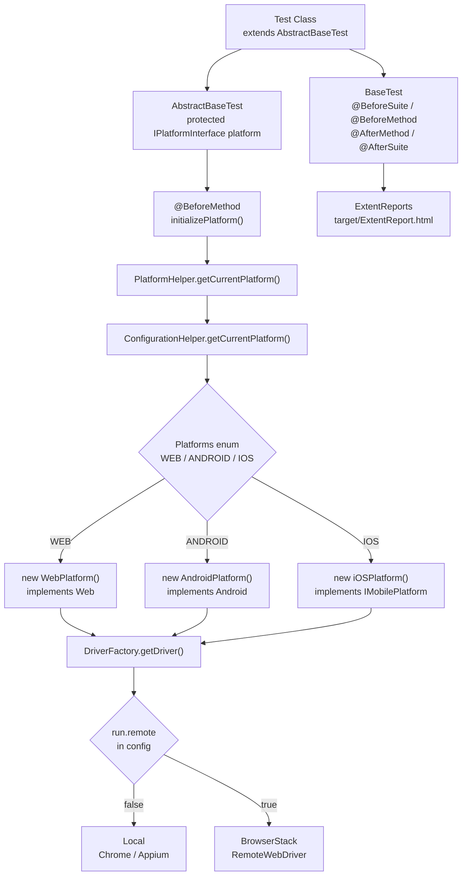
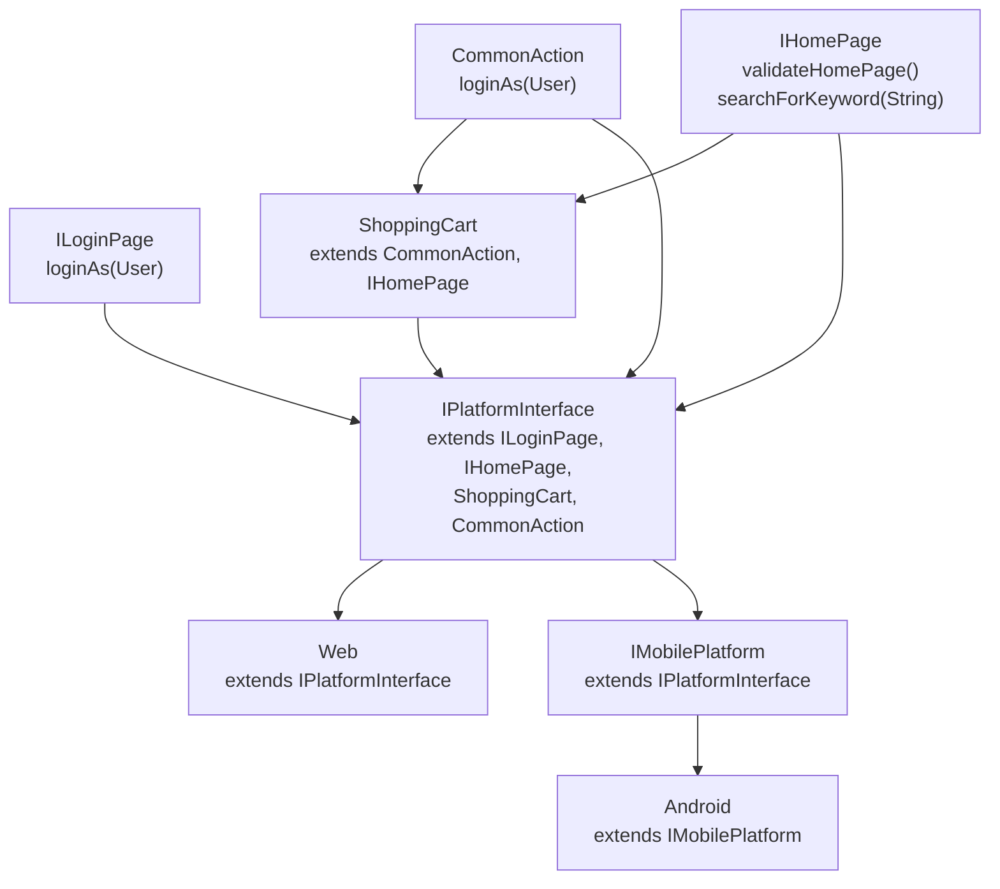
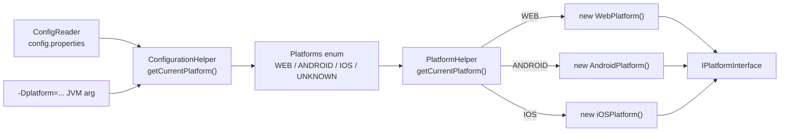
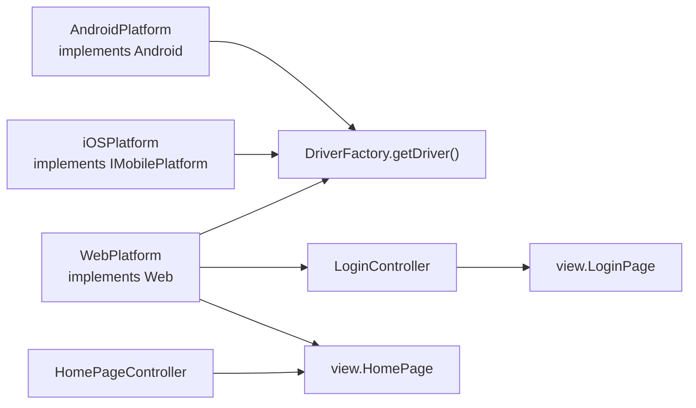
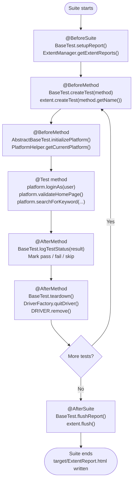
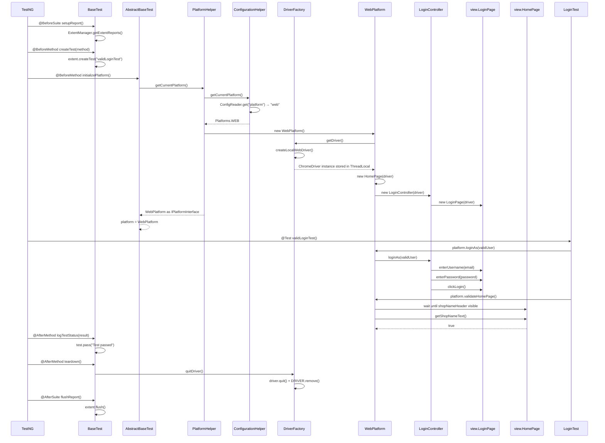
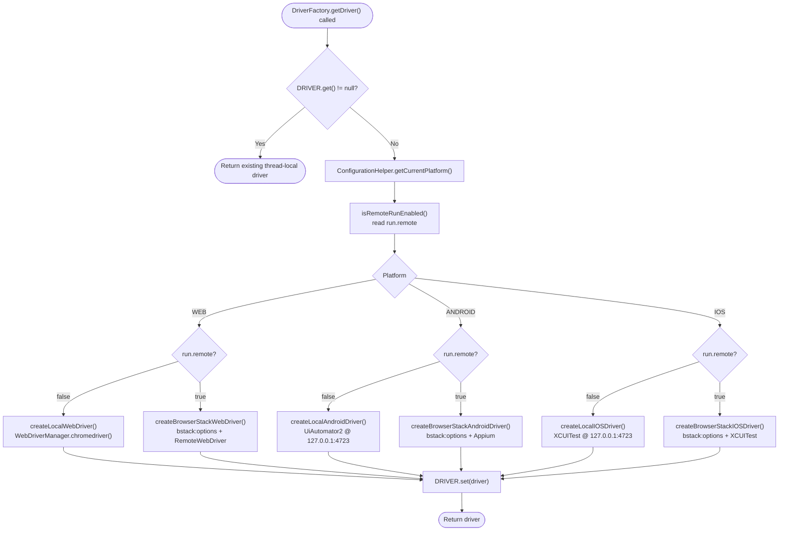
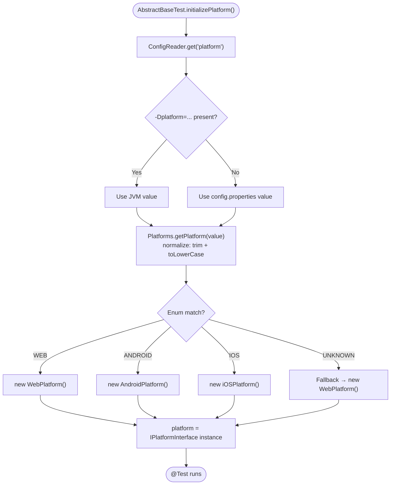

# SeleniumTestNGFramework

A **Java + Selenium 4 + TestNG** test automation framework built around **MVC architecture**, an **interface-driven platform contract**, and a **single unified test entry point**.

The framework routes every test through a single `IPlatformInterface` reference that is resolved before each test based on the active platform configured in `config.properties` or via JVM arguments.

---

## Table of Contents

- [Tech Stack](#tech-stack)
- [Implementation Status](#implementation-status)
- [Project Structure](#project-structure)
- [Architecture Overview](#architecture-overview)
- [Interface Hierarchy](#interface-hierarchy)
- [Layer Breakdown](#layer-breakdown)
- [TestNG Lifecycle Flow](#testng-lifecycle-flow)
- [Execution Flow — Sequence Diagram](#execution-flow--sequence-diagram)
- [Driver Factory Flow](#driver-factory-flow)
- [Platform Selection Flow](#platform-selection-flow)
- [Configuration Reference](#configuration-reference)
- [Run Commands](#run-commands)
- [BrowserStack Integration](#browserstack-integration)
- [Reporting](#reporting)
- [Current Test Coverage](#current-test-coverage)
- [Adding a New Test](#adding-a-new-test)

---

## Tech Stack

| Tool | Version | Purpose |
|---|---|---|
| Java | 17+ | Core language |
| Selenium | 4.20.0 | WebDriver API and browser automation |
| TestNG | 7.9.0 | Test runner + lifecycle annotations |
| WebDriverManager | 6.2.0 | Automatic local driver binary management |
| ExtentReports | 5.0.9 | HTML test reporting |
| Maven | 3.8+ | Build and dependency management |

---

## Implementation Status

| Component | Status | Notes |
|---|---|---|
| `WebPlatform` | ✅ Implemented | `loginAs`, `validateHomePage`, `searchForKeyword` all working |
| `AndroidPlatform` | 🔧 Wired | Driver setup complete, business methods are TODO |
| `iOSPlatform` | 🔧 Wired | Driver setup complete, business methods are TODO |
| `DriverFactory` | ✅ Implemented | Local + BrowserStack for Web, Android, iOS |
| `IPlatformInterface` | ✅ Implemented | Central interface binding all platform contracts |
| `AbstractBaseTest` | ✅ Implemented | Resolves and injects `platform` before every test |
| `BaseTest` | ✅ Implemented | Reporting lifecycle and driver teardown |
| `testng.xml` | ⚠️ Partial | Contains only `tests.LoginTest` |
| `tests.HomePage` | ⚠️ Excluded | Exists but not listed in `testng.xml` |

---

## Project Structure

```text
SeleniumTestNGFramework/
├── pom.xml                           # Maven build + dependencies
├── testng.xml                        # Suite definition
├── .gitignore
├── README.md
└── src/
    ├── main/
    │   └── java/
    │       ├── interfaces/           # All platform and action contracts
    │       │   ├── IPlatformInterface.java   ← central unified contract
    │       │   ├── ShoppingCart.java
    │       │   ├── CommonAction.java
    │       │   ├── ILoginPage.java
    │       │   ├── IHomePage.java
    │       │   ├── Web.java
    │       │   ├── IMobilePlatform.java
    │       │   └── Android.java
    │       ├── model/
    │       │   └── User.java                 ← credentials data object
    │       ├── view/                 # Page Objects (MVC — View)
    │       │   ├── LoginPage.java
    │       │   └── HomePage.java
    │       ├── controller/           # Platform implementations (MVC — Controller)
    │       │   ├── WebPlatform.java  ← fully implemented
    │       │   ├── AndroidPlatform.java
    │       │   ├── iOSPlatform.java
    │       │   ├── LoginController.java
    │       │   ├── HomePageController.java
    │       │   └── ShoppingCartHelper.java   (placeholder)
    │       ├── helper/               # Platform resolution
    │       │   ├── Platforms.java            ← enum WEB / ANDROID / IOS / UNKNOWN
    │       │   ├── ConfigurationHelper.java  ← reads platform from config / JVM
    │       │   └── PlatformHelper.java       ← creates IPlatformInterface instance
    │       └── utils/                # Framework infrastructure
    │           ├── AbstractBaseTest.java     ← test entry point, holds `platform`
    │           ├── BaseTest.java             ← TestNG hooks + reporting + teardown
    │           ├── DriverFactory.java        ← ThreadLocal driver, local + BrowserStack
    │           ├── ConfigReader.java         ← loads config.properties
    │           ├── ExtentManager.java        ← singleton ExtentReports
    │           ├── DriverComponentHelper.java (placeholder)
    │           └── WebDriverInstanceFactory.java (placeholder)
    └── test/
        ├── java/tests/
        │   ├── LoginTest.java        ← included in testng.xml
        │   └── HomePage.java         ← NOT included in testng.xml
        └── resources/
            └── config.properties     ← all runtime config
```

---

## Architecture Overview



---

## Interface Hierarchy

`IPlatformInterface` is the **central contract** that unifies all platform-specific and page-level interfaces. All test interactions go through this single type.



| Interface | Extends | Methods available |
|---|---|---|
| `CommonAction` | — | `loginAs(User)` |
| `ILoginPage` | — | `loginAs(User)` |
| `IHomePage` | — | `validateHomePage()`, `searchForKeyword(String)` |
| `ShoppingCart` | `CommonAction`, `IHomePage` | `loginAs`, `validateHomePage`, `searchForKeyword` |
| `IPlatformInterface` | `ILoginPage`, `IHomePage`, `ShoppingCart`, `CommonAction` | all of the above |
| `Web` | `IPlatformInterface` | inherits all |
| `IMobilePlatform` | `IPlatformInterface` | inherits all |
| `Android` | `IMobilePlatform` | inherits all |

---

## Layer Breakdown

### 1. Utils Layer — Test Infrastructure

#### `AbstractBaseTest`
The **single parent** for all test classes. Provides `platform` — the only object tests ever interact with.

```java
public abstract class AbstractBaseTest extends BaseTest {

    protected IPlatformInterface platform;

    @BeforeMethod(alwaysRun = true)
    public void initializePlatform() {
        platform = PlatformHelper.getCurrentPlatform();
    }
}
```

#### `BaseTest`
Handles the full reporting lifecycle and driver cleanup. Tests never call any of these directly.

| Annotation | Method | What it does |
|---|---|---|
| `@BeforeSuite` | `setupReport()` | Initialises `ExtentReports` via `ExtentManager` |
| `@BeforeMethod` | `createTest(Method)` | Creates one test node per method |
| `@AfterMethod` | `logTestStatus(ITestResult)` | Marks the node pass / fail / skip |
| `@AfterMethod` | `teardown()` | Calls `DriverFactory.quitDriver()` and nulls `driver` |
| `@AfterSuite` | `flushReport()` | Flushes `ExtentReport.html` to disk |

#### `DriverFactory`
Thread-safe driver provider using `ThreadLocal<WebDriver>`.

```java
private static final ThreadLocal<WebDriver> DRIVER = new ThreadLocal<>();
```

Each test thread holds its own driver independently — safe for parallel execution.

#### `ConfigReader`
Loads `src/test/resources/config.properties` from the classpath. Falls back to a file-path lookup if the classpath load fails.

#### `ExtentManager`
Singleton holder for `ExtentReports`. Writes the HTML report to `target/ExtentReport.html`.

---

### 2. Helper Layer — Platform Resolution



| Class | Responsibility |
|---|---|
| `Platforms` | Enum `WEB / ANDROID / IOS / UNKNOWN`. Case-insensitive, null-safe resolution |
| `ConfigurationHelper` | Reads `platform` from config; `-Dplatform=` JVM arg overrides it; falls back to `WEB` on `UNKNOWN` |
| `PlatformHelper` | Calls `ConfigurationHelper`, then returns the matching `IPlatformInterface` implementation |

---

### 3. Model Layer

```java
User user = new User("user@mail.com", "Password123");
user.getUsername();  // → "user@mail.com"
user.getPassword();  // → "Password123"
```

`User` is a simple immutable data class with no Selenium dependency.

---

### 4. View Layer — Page Objects

Page objects hold locators and low-level browser actions. No business logic. Controllers and platform classes call views — tests never touch them directly.

#### `view.LoginPage`

| Element | Locator |
|---|---|
| Username | `id="userEmail"` |
| Password | `id="userPassword"` |
| Login button | `id="login"` |
| Remember me | `xpath=//input[@type='checkbox']` |

Methods: `enterUsername(String)`, `enterPassword(String)`, `clickLogin()`, `clickRememberMe()`

#### `view.HomePage`

| Element | Locator |
|---|---|
| HOME header | `xpath=//button[contains(.,'HOME')]` |
| Search input | `xpath=//input[@name='search']` |
| Price tag | `xpath=(//span[@class='prod_price_amount '])[1]` |

Methods: `getShopNameHeader()`, `getShopNameText()`, `getSearchInput()`, `getPriceTag()`, `getSearchKeyword(String)`

---

### 5. Controller Layer — Platform Implementations



#### `WebPlatform` — Fully Implemented

Constructor eagerly resolves `WebDriver`, `view.HomePage`, and `LoginController`:

```java
public WebPlatform() {
    driver = DriverFactory.getDriver();
    homePage = new HomePage(driver);
    loginController = new LoginController(driver);
}
```

| Method | Delegates to |
|---|---|
| `loginAs(User)` | `LoginController` → `view.LoginPage` |
| `validateHomePage()` | `view.HomePage` — waits for HOME button, asserts displayed |
| `searchForKeyword(String)` | `view.HomePage` — types in search box, waits for price tag |

#### `AndroidPlatform` — Driver Wired, Methods TODO

Lazily resolves `DriverFactory.getDriver()` on first use. `loginAs`, `validateHomePage`, `searchForKeyword` are placeholders.

#### `iOSPlatform` — Driver Wired, Methods TODO

Same pattern as `AndroidPlatform`. Uses `XCUITest` driver via Appium or BrowserStack.

#### `LoginController`

Delegates to `view.LoginPage`:

```java
loginPage.enterUsername(user.getUsername());
loginPage.enterPassword(user.getPassword());
loginPage.clickLogin();
```

#### `HomePageController`

Implements `IHomePage` with `WebDriverWait`-backed validation and search. Currently exists and is implemented but is **not the active path in `WebPlatform`** — `WebPlatform` uses `view.HomePage` directly.

---

## TestNG Lifecycle Flow



> **Order note:** TestNG runs `@BeforeMethod` methods in class hierarchy order — `BaseTest.createTest()` runs before `AbstractBaseTest.initializePlatform()` because `BaseTest` is the parent.

---

## Execution Flow — Sequence Diagram

End-to-end trace for `tests.LoginTest.validLoginTest()` on `platform=web, run.remote=false`:



---

## Driver Factory Flow

`DriverFactory` is the runtime driver routing engine. It is thread-safe, lazy, and platform-aware.



### Why `ThreadLocal<WebDriver>`?

```java
private static final ThreadLocal<WebDriver> DRIVER = new ThreadLocal<>();
```

Each thread gets its own isolated driver — essential for parallel test execution:

```text
Thread A  →  DRIVER.get()  →  ChromeDriver session A
Thread B  →  DRIVER.get()  →  ChromeDriver session B
Thread C  →  DRIVER.get()  →  Appium session C
```

`DRIVER.remove()` inside `quitDriver()` clears the slot immediately after each test, preventing stale driver leaks when TestNG reuses threads.

### Setting resolution priority in `DriverFactory`

For every setting (except credentials):

```text
1. JVM system property    -Dkey=value
2. Environment variable   ENV_VAR_NAME
3. config.properties      key=value
4. Hardcoded fallback
```

For BrowserStack credentials specifically:

```text
1. -Dbrowserstack.username / -Dbrowserstack.accessKey
2. BROWSERSTACK_USERNAME  / BROWSERSTACK_ACCESS_KEY
3. BROWSERSTACK_USER      / BROWSERSTACK_KEY   (aliases)
4. config.properties browserstack.username / browserstack.accessKey
```

---

## Platform Selection Flow



---

## Configuration Reference

All settings live in `src/test/resources/config.properties`. Every key can be overridden at the command line with `-Dkey=value`.

```properties
# Application
login.url=https://rahulshettyacademy.com/client/#/auth/login
login.username=vijaydurairaj@mail.com
login.password=P@ssword@1
home.searchbox=apple watch

# Execution mode
platform=web                  # web | android | ios
run.remote=false              # false = local   true = BrowserStack

# BrowserStack — Web
browserstack.browser=Chrome
browserstack.browserVersion=latest
browserstack.os=Windows
browserstack.osVersion=11
browserstack.projectName=SeleniumTestNGFramework
browserstack.buildName=Local Build
browserstack.sessionName=Login Smoke
browserstack.local=false
browserstack.localIdentifier=

# Android
android.deviceName=emulator-5554
android.platformVersion=13.0
android.browserName=Chrome

# iOS
ios.deviceName=iPhone 15
ios.platformVersion=17.0
ios.browserName=Safari
```

### Config key usage map

| Key | Read by | Purpose |
|---|---|---|
| `platform` | `ConfigurationHelper` + `DriverFactory` | Selects Web / Android / iOS |
| `run.remote` | `DriverFactory` | Local vs BrowserStack |
| `login.username` | `tests.LoginTest` | Credentials for login test |
| `login.password` | `tests.LoginTest` | Credentials for login test |
| `home.searchbox` | `tests.HomePage` | Keyword for search test |
| `browserstack.*` | `DriverFactory` | BrowserStack session capabilities |
| `android.*` | `DriverFactory` | Android Appium capabilities |
| `ios.*` | `DriverFactory` | iOS Appium capabilities |
| `login.url` | ⚠️ Not read by any class yet | Present in config but not used at runtime |

---

## Run Commands

### Default — local web

```bash
mvn test
```

### Run a specific test class

```bash
mvn -Dtest=tests.LoginTest test
mvn -Dtest=tests.HomePage test
```

### Override platform at runtime

```bash
# Web (default)
mvn test -Dplatform=web

# Android — requires Appium running at http://127.0.0.1:4723/wd/hub
mvn test -Dplatform=android

# iOS — requires Appium running at http://127.0.0.1:4723/wd/hub
mvn test -Dplatform=ios
```

### Run via TestNG suite file

```bash
mvn test -DsuiteXmlFile=testng.xml
```

### Toggle remote / local

```bash
mvn test -Drun.remote=false -Dplatform=web
mvn test -Drun.remote=true  -Dplatform=web
```

---

## BrowserStack Integration

`DriverFactory` has full BrowserStack support for all three platforms.

### Step 1 — Export credentials

```bash
export BROWSERSTACK_USERNAME="your_username"
export BROWSERSTACK_ACCESS_KEY="your_access_key"
```

### Step 2 — Run on BrowserStack

```bash
# Web
mvn test -Drun.remote=true -Dplatform=web

# Android
mvn test -Drun.remote=true -Dplatform=android

# iOS
mvn test -Drun.remote=true -Dplatform=ios
```

### Override BrowserStack capabilities inline

```bash
mvn test \
  -Drun.remote=true \
  -Dplatform=web \
  -Dbrowserstack.browser=Chrome \
  -Dbrowserstack.browserVersion=latest \
  -Dbrowserstack.os=Windows \
  -Dbrowserstack.osVersion=11 \
  -Dbrowserstack.buildName="CI Build #42" \
  -Dbrowserstack.sessionName="Login Smoke"
```

### BrowserStack Local tunnel

```bash
# 1. Start BrowserStack Local binary first
# 2. Then run with local=true
mvn test \
  -Drun.remote=true \
  -Dplatform=web \
  -Dbrowserstack.local=true \
  -Dbrowserstack.localIdentifier="my_tunnel"
```

---

## Reporting

ExtentReports HTML report is generated automatically after every run.

| Event | Action |
|---|---|
| `@BeforeSuite` | `ExtentManager.getExtentReports()` creates the singleton |
| `@BeforeMethod` | `extent.createTest(methodName)` creates one node per test |
| `@AfterMethod` | Node is marked pass / fail / skip |
| `@AfterSuite` | `extent.flush()` writes the file |

**Report output:**

```text
target/ExtentReport.html
```

Open in any browser to view the full test run history with timestamps.

---

## Current Test Coverage

### `tests.LoginTest` — included in `testng.xml`

```java
public class LoginTest extends AbstractBaseTest {

    @Test
    public void validLoginTest() {
        User validUser = new User(
            ConfigReader.get("login.username"),
            ConfigReader.get("login.password")
        );
        platform.loginAs(validUser);
        platform.validateHomePage();
    }
}
```

Covers: login form submission → home page header validation.

---

### `tests.HomePage` — **not** included in `testng.xml`

```java
public class HomePage extends AbstractBaseTest {

    @Test
    public void searchKeywordTest() {
        platform.searchForKeyword(ConfigReader.get("home.searchbox"));
    }
}
```

Covers: keyword search → wait for first result price tag.

To run it explicitly:

```bash
mvn -Dtest=tests.HomePage test
```

---

## Adding a New Test

### 1. Create the test class

```java
package tests;

import model.User;
import org.testng.annotations.Test;
import utils.AbstractBaseTest;
import utils.ConfigReader;

public class CartTest extends AbstractBaseTest {

    @Test
    public void addToCartTest() {
        User user = new User(
            ConfigReader.get("login.username"),
            ConfigReader.get("login.password")
        );
        platform.loginAs(user);
        platform.validateHomePage();
        platform.searchForKeyword(ConfigReader.get("home.searchbox"));
        // add cart-specific calls here as new interface methods are added
    }
}
```

### 2. Add to `testng.xml` if you want suite execution

```xml
<suite name="MVC Framework Suite">
    <test name="Login Tests">
        <classes>
            <class name="tests.LoginTest"/>
            <class name="tests.HomePage"/>
            <class name="tests.CartTest"/>
        </classes>
    </test>
</suite>
```

### 3. Adding a new action across platforms

Follow this order so no platform is accidentally broken:

| Step | Where | What to do |
|---|---|---|
| 1 | `IHomePage` or `CommonAction` or `IPlatformInterface` | Add the method signature |
| 2 | `WebPlatform` | Implement the real logic using the view layer |
| 3 | `AndroidPlatform` / `iOSPlatform` | Add the method body (or mark TODO) |
| 4 | Test class | Call `platform.newMethod()` |

> Tests must **only** call `platform.xxx()` — never instantiate `DriverFactory`, controllers, or page objects directly inside a test class.

---

## Design Rules

| Rule | Reason |
|---|---|
| All tests extend `AbstractBaseTest` | Gets lifecycle, reporting, and `platform` for free |
| Tests call only `platform.*` | Decouples tests from all Selenium and platform specifics |
| `IPlatformInterface` is the single test contract | Ensures Web, Android, and iOS all expose the same API |
| Driver is resolved lazily per thread via `ThreadLocal` | Safe for parallel execution, no shared state |
| Platform is resolved fresh per test via `@BeforeMethod` | Prevents stale driver references across tests |
| Config overridable with `-D` args | Supports CI/CD without modifying files |
