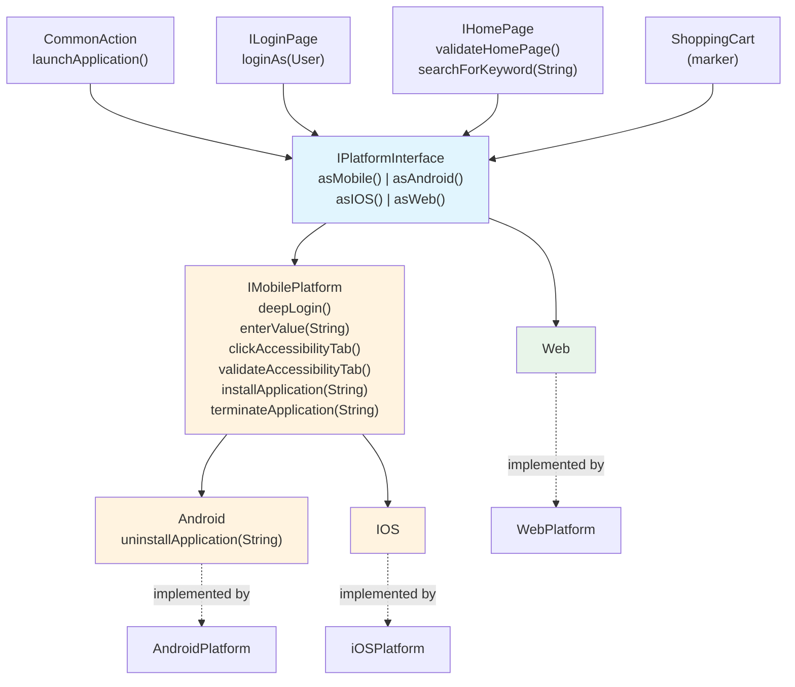
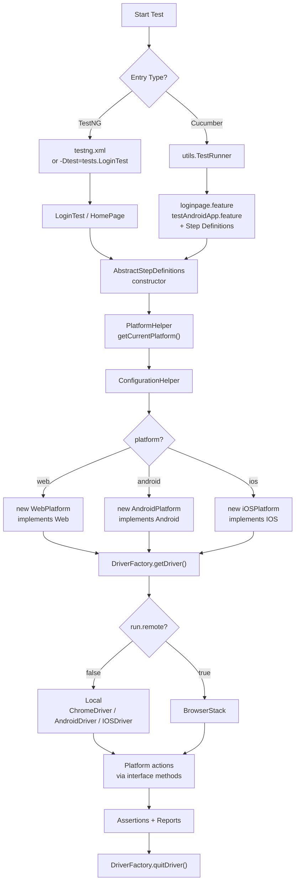
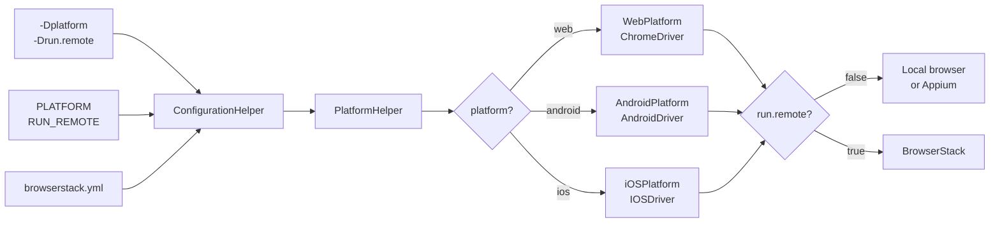

# SeleniumFramework

A **cross-platform UI automation framework** built with Java, Selenium 4, Appium, Cucumber, and TestNG.  
One set of tests runs against **Web**, **Android**, and **iOS** — locally or on **BrowserStack** — by switching a single config value.

---

## Table of Contents

- [Key Features](#key-features)
- [Tech Stack](#tech-stack)
- [Project Structure](#project-structure)
- [Interface Hierarchy](#interface-hierarchy)
- [How Platform Casting Works](#how-platform-casting-works)
- [Layer Responsibilities](#layer-responsibilities)
- [End-to-End Execution Flow](#end-to-end-execution-flow)
- [Runtime Platform and Driver Selection](#runtime-platform-and-driver-selection)
- [Configuration](#configuration)
- [How to Run](#how-to-run)
- [BrowserStack Execution](#browserstack-execution)
- [Reports](#reports)
- [How to Add New Coverage](#how-to-add-new-coverage)
- [Current Limitations](#current-limitations)

---

## Key Features

| Capability | Detail |
|---|---|
| **Contract-first design** | Tests depend on interfaces, never on concrete platform classes |
| **Clean interface separation** | Common, mobile-shared, Android-only, iOS-only, and web-only methods each live at the correct level |
| **No empty stubs** | `WebPlatform` never implements mobile methods; `AndroidPlatform` never implements web methods |
| **Platform casting helpers** | `asMobile()`, `asAndroid()`, `asIOS()`, `asWeb()` — type-safe access to platform-specific methods |
| **Runtime platform selection** | JVM arg, env var, or YAML config |
| **Local + BrowserStack** | Toggle with `-Drun.remote=true` |
| **Two test entry paths** | TestNG classes and Cucumber BDD |
| **Thread-safe drivers** | `DriverFactory` uses `ThreadLocal` for parallel execution |
| **Native Appium drivers** | `AndroidDriver` / `IOSDriver` for full Appium API (installApp, removeApp, activateApp, etc.) |

---

## Tech Stack

| Library | Version | Purpose |
|---|---|---|
| Java | 17+ | Language |
| Selenium | 4.20.0 | Browser automation |
| Appium Java Client | 9.3.0 | Mobile automation (`AndroidDriver`, `IOSDriver`) |
| TestNG | 7.9.0 | Test runner |
| Cucumber | 7.15.0 | BDD runner (`cucumber-java`, `cucumber-junit`) |
| WebDriverManager | 6.2.0 | Automatic chromedriver management |
| ExtentReports | 5.0.9 | HTML test reports |
| BrowserStack SDK | 1.26.1 | Cloud device execution |
| SnakeYAML | 2.2 | YAML config parsing |
| Maven | — | Build and dependency management |

---

## Project Structure

```text
SeleniumFramework/
├── pom.xml
├── testng.xml
├── README.md
└── src/test/
    ├── java/
    │   ├── helper/
    │   │   ├── BaseTest.java                  # TestNG report lifecycle
    │   │   ├── BrowserStackConfigReader.java  # Reads browserstack.yml
    │   │   ├── ConfigReader.java              # Reads config.properties
    │   │   ├── ConfigurationHelper.java       # Resolves active platform
    │   │   ├── DriverFactory.java             # Thread-safe driver creation
    │   │   ├── ExtentManager.java             # ExtentReports singleton
    │   │   ├── PlatformHelper.java            # Factory for platform instances
    │   │   └── Platforms.java                 # Enum: ANDROID, IOS, WEB
    │   │
    │   ├── interfaces/
    │   │   ├── CommonAction.java              # launchApplication()
    │   │   ├── ILoginPage.java                # loginAs(User)
    │   │   ├── IHomePage.java                 # validateHomePage(), searchForKeyword()
    │   │   ├── ShoppingCart.java              # Marker interface
    │   │   ├── IPlatformInterface.java        # Common contract + casting helpers
    │   │   ├── IMobilePlatform.java           # Mobile-shared methods
    │   │   ├── Android.java                   # Android-only methods
    │   │   ├── IOS.java                       # iOS-only (extension point)
    │   │   └── Web.java                       # Web-only (extension point)
    │   │
    │   ├── model/
    │   │   └── User.java
    │   │
    │   ├── modules/
    │   │   ├── WebPlatform.java               # implements Web
    │   │   ├── AndroidPlatform.java           # implements Android
    │   │   └── iOSPlatform.java               # implements IOS
    │   │
    │   ├── pageobjects/
    │   │   ├── web/
    │   │   │   ├── LoginPage.java
    │   │   │   └── HomePage.java
    │   │   └── android/
    │   │       └── TestMobileHomePage.java
    │   │
    │   ├── stepdefinitions/
    │   │   ├── AbstractStepDefinitions.java
    │   │   ├── LoginPageSteps.java
    │   │   └── TestAndroidMobileApplicationSteps.java
    │   │
    │   ├── tests/
    │   │   ├── LoginTest.java
    │   │   └── HomePage.java
    │   │
    │   └── utils/
    │       └── TestRunner.java
    │
    └── resources/
        ├── config/
        │   ├── browserstack.yml
        │   └── config.properties
        ├── features/
        │   ├── loginpage.feature
        │   └── testAndroidApp.feature
        └── application/
            └── ApiDemos-debug.apk
```

---

## Interface Hierarchy

Each level in the hierarchy adds only the methods that belong at that scope. A platform class implements **one** interface and gets exactly the methods it needs — nothing more.



**How to read the diagram:**

| Arrow | Meaning |
|---|---|
| Solid (`→`) | **extends** — interface inheritance |
| Dotted (`-.->`) | **implements** — class fulfills the interface |

**Key points:**
- `WebPlatform implements Web` → only common methods, zero mobile stubs needed
- `AndroidPlatform implements Android` → common + mobile-shared + Android-only
- `iOSPlatform implements IOS` → common + mobile-shared + iOS extension point
- `ShoppingCart` is a standalone marker interface (no methods, no parent)

### What each level owns

| Level | Interface | Methods defined at this level |
|---|---|---|
| **Behavior contracts** | `CommonAction` | `launchApplication()` |
| | `ILoginPage` | `loginAs(User)` |
| | `IHomePage` | `validateHomePage()`, `searchForKeyword(String)` |
| | `ShoppingCart` | *(empty marker)* |
| **Common** | `IPlatformInterface` | Inherits all above + `asMobile()`, `asAndroid()`, `asIOS()`, `asWeb()` |
| **Mobile shared** | `IMobilePlatform` | `deepLogin()`, `enterValue()`, `clickAccessibilityTab()`, `validateAccessibilityTab()`, `installApplication()`, `terminateApplication()` |
| **Android only** | `Android` | `uninstallApplication()` |
| **iOS only** | `IOS` | *(extension point)* |
| **Web only** | `Web` | *(extension point)* |

---

## How Platform Casting Works

In step definitions, `platform` is typed as `IPlatformInterface`. Four default casting helpers let you reach platform-specific methods:

```java
// ── Common — works on ALL platforms ──────────────────────────
platform.launchApplication();
platform.loginAs(user);
platform.validateHomePage();
platform.searchForKeyword("watch");

// ── Mobile shared — Android + iOS ───────────────────────────
platform.asMobile().deepLogin();
platform.asMobile().installApplication(apkPath);
platform.asMobile().terminateApplication(packageName);

// ── Android only ─────────────────────────────────────────────
platform.asAndroid().uninstallApplication(packageName);

// ── iOS only (add future methods to IOS interface) ───────────
platform.asIOS().someIOSMethod();

// ── Web only (add future methods to Web interface) ───────────
platform.asWeb().someWebMethod();
```

### IDE autocomplete at each level

| You type | Methods shown |
|---|---|
| `platform.` | `launchApplication`, `loginAs`, `validateHomePage`, `searchForKeyword` + `asMobile`, `asAndroid`, `asIOS`, `asWeb` |
| `platform.asMobile().` | `deepLogin`, `enterValue`, `clickAccessibilityTab`, `validateAccessibilityTab`, `installApplication`, `terminateApplication` + all common |
| `platform.asAndroid().` | `uninstallApplication` + all mobile-shared + all common |
| `platform.asIOS().` | *(future iOS methods)* + all mobile-shared + all common |
| `platform.asWeb().` | *(future web methods)* + all common |

### Runtime safety

Calling `platform.asMobile()` when the platform is `WebPlatform` throws:
```
UnsupportedOperationException: WebPlatform is not a mobile platform
```

---

## Layer Responsibilities

### `interfaces/` — Contracts

Defines **what** each platform must do. Tests never depend on concrete classes.

| Interface | Extends | Own methods |
|---|---|---|
| `CommonAction` | — | `launchApplication()` |
| `ILoginPage` | — | `loginAs(User)` |
| `IHomePage` | — | `validateHomePage()`, `searchForKeyword(String)` |
| `ShoppingCart` | — | *(empty marker)* |
| `IPlatformInterface` | `ILoginPage`, `IHomePage`, `ShoppingCart`, `CommonAction` | `asMobile()`, `asAndroid()`, `asIOS()`, `asWeb()` |
| `IMobilePlatform` | `IPlatformInterface` | `deepLogin()`, `enterValue()`, `clickAccessibilityTab()`, `validateAccessibilityTab()`, `installApplication()`, `terminateApplication()` |
| `Android` | `IMobilePlatform` | `uninstallApplication()` |
| `IOS` | `IMobilePlatform` | *(extension point)* |
| `Web` | `IPlatformInterface` | *(extension point)* |

### `modules/` — Implementations

| Class | Implements | Driver | Status |
|---|---|---|---|
| `WebPlatform` | `Web` | `ChromeDriver` | ✅ Full — login, home validation, search |
| `AndroidPlatform` | `Android` | `AndroidDriver` | ✅ Deep-link, app install/uninstall/terminate, accessibility |
| `iOSPlatform` | `IOS` | `IOSDriver` | ⚙️ Stubs — driver wiring ready |

### `helper/` — Infrastructure

| Class | Purpose |
|---|---|
| `ConfigReader` | Loads `config.properties` (app URLs, credentials, APK paths) |
| `BrowserStackConfigReader` | Loads `browserstack.yml` — priority: **JVM arg → env var → YAML → fallback** |
| `ConfigurationHelper` | Resolves active platform (`WEB` / `ANDROID` / `IOS`) |
| `PlatformHelper` | Factory — returns cached `IPlatformInterface` instance |
| `DriverFactory` | Thread-safe driver creation via `ThreadLocal`. Returns `ChromeDriver`, `AndroidDriver`, or `IOSDriver` based on platform + local/remote config |
| `Platforms` | Enum: `ANDROID`, `IOS`, `WEB`, `UNKNOWN` |
| `BaseTest` + `ExtentManager` | TestNG + ExtentReports lifecycle |

### `pageobjects/` — Page Object Model

| Class | Platform | Key elements |
|---|---|---|
| `pageobjects.web.LoginPage` | Web | `usernameInput`, `passwordInput`, `loginButton` |
| `pageobjects.web.HomePage` | Web | `shopNameHeader`, `searchInput`, `priceTag` |
| `pageobjects.android.TestMobileHomePage` | Android | Accessibility tab, API Demos header |

### `stepdefinitions/` — Cucumber Glue

| Class | Scope | Example calls |
|---|---|---|
| `AbstractStepDefinitions` | Base | Initializes `platform`, provides `getOrSaveData()` cache |
| `LoginPageSteps` | Login / deeplink / input | `platform.launchApplication()`, `platform.asMobile().deepLogin()`, `platform.asMobile().enterValue()` |
| `TestAndroidMobileApplicationSteps` | Android app lifecycle | `platform.asMobile().installApplication()`, `platform.asAndroid().uninstallApplication()` |

### `tests/` — TestNG Tests

| Class | Tests |
|---|---|
| `LoginTest` | `validLoginTest()` — full web login; `deepLinkLoginTest()` — mobile deep-link |
| `HomePage` | `searchKeywordTest()` — launch + search |

---

## End-to-End Execution Flow



---

## Runtime Platform and Driver Selection



**Resolution priority** (highest wins):

1. JVM system property — `-Dplatform=android`
2. Environment variable — `PLATFORM=android`
3. `browserstack.yml` → `execution.platform`
4. Default: `web`

---

## Configuration

### `config.properties` — Application Test Data

```properties
login.url=https://rahulshettyacademy.com/client/#/auth/login
login.username=vijaydurairaj@mail.com
login.password=P@ssword@1
home.searchbox=apple watch
android.apk=src/test/resources/application/ApiDemos-debug.apk
android.appPackage=io.appium.android.apis
```

### `browserstack.yml` — Execution, Platform, and Devices

```yaml
execution:
  platform: android         # web | android | ios
  remote: false             # false = local | true = BrowserStack

credentials:
  username: ""              # env: BROWSERSTACK_USERNAME
  accessKey: ""             # env: BROWSERSTACK_ACCESS_KEY

web:
  browser: Chrome
  browserVersion: latest

android:
  local:
    deviceName: emulator-5554
    platformVersion: "11"
    appPackage: io.appium.android.apis
    appActivity: io.appium.android.apis.ApiDemos
  bstack:
    deviceName: Samsung Galaxy S23
    osVersion: "13.0"

ios:
  local:
    deviceName: iPhone 15
    platformVersion: "17.0"
    browserName: Safari
  bstack:
    deviceName: iPhone 15
    osVersion: "17"
```

Override any value at runtime:

```bash
mvn test -Dplatform=web -Drun.remote=false
export PLATFORM=android && mvn test
```

---

## How to Run

### Local execution

```bash
# Web (default)
mvn test -Dplatform=web

# Android (requires Appium + emulator)
mvn test -Dplatform=android

# iOS (requires Appium + simulator)
mvn test -Dplatform=ios
```

### TestNG

```bash
mvn test -DsuiteXmlFile=testng.xml
mvn -Dtest=tests.LoginTest test
mvn -Dtest=tests.HomePage test
```

### Cucumber

```bash
mvn -Dtest=utils.TestRunner test
```

### BrowserStack

```bash
export BROWSERSTACK_USERNAME="your-user"
export BROWSERSTACK_ACCESS_KEY="your-key"
mvn test -Dplatform=web -Drun.remote=true
mvn test -Dplatform=android -Drun.remote=true
```

---

## BrowserStack Execution

| What | How |
|---|---|
| Set credentials | `BROWSERSTACK_USERNAME` / `BROWSERSTACK_ACCESS_KEY` env vars |
| Toggle remote | `-Drun.remote=true` or `execution.remote: true` in YAML |
| View results | [BrowserStack Automate Dashboard](https://automate.browserstack.com/) |
| Device selection | `browserstack.yml` → `android.bstack.*` / `ios.bstack.*` |

---

## Reports

| Report | Location |
|---|---|
| ExtentReports HTML | `target/ExtentReport.html` |
| Cucumber JSON | `target/cucumber-reports/Cucumber.json` |
| Cucumber XML | `target/cucumber-reports/Cucumber.xml` |
| Surefire reports | `target/surefire-reports/` |

---

## How to Add New Coverage

### Common method (all platforms)

1. Add to `IHomePage`, `ILoginPage`, `CommonAction`, or a new behavior interface
2. If new interface → wire it into `IPlatformInterface extends ...`
3. Implement in `WebPlatform`, `AndroidPlatform`, `iOSPlatform`

### Mobile-shared method (Android + iOS)

1. Add to `IMobilePlatform`
2. Implement in `AndroidPlatform` and `iOSPlatform`
3. Call via `platform.asMobile().newMethod()`

### Android-only method

1. Add to `Android` interface
2. Implement in `AndroidPlatform`
3. Call via `platform.asAndroid().newMethod()`

### iOS-only method

1. Add to `IOS` interface
2. Implement in `iOSPlatform`
3. Call via `platform.asIOS().newMethod()`

### Web-only method

1. Add to `Web` interface
2. Implement in `WebPlatform`
3. Call via `platform.asWeb().newMethod()`

### Page objects

- Web → `pageobjects/web/`
- Android → `pageobjects/android/`
- iOS → `pageobjects/ios/` (create as needed)

---

## Current Limitations

- `iOSPlatform` has stub implementations — driver wiring is ready but business flows need implementation
- Page objects for iOS need to be created under `pageobjects/ios/`
- `ShoppingCart` is an empty marker interface — no cart-specific actions defined yet
- `BaseTest` / `ExtentManager` are wired for TestNG only; Cucumber uses its own reporter plugins
