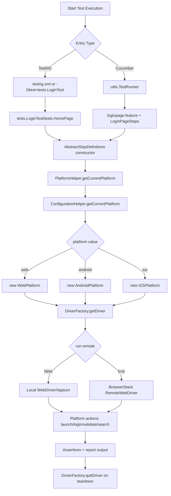
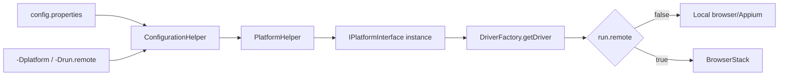

# SeleniumFramework

Java UI automation framework using Selenium 4 with both TestNG and Cucumber execution paths, plus platform routing for Web, Android, and iOS.

## What This Framework Supports

- Single platform abstraction through `interfaces.IPlatformInterface`
- Runtime platform selection via `platform` config (`web`, `android`, `ios`)
- Local and BrowserStack execution via `helper.DriverFactory`
- Two entry paths:
  - TestNG tests in `src/test/java/tests`
  - Cucumber runner in `src/test/java/utils/TestRunner.java`

## Tech Stack

- Java 17+
- Selenium 4.20.0
- TestNG 7.9.0
- Cucumber 7.15.0 (`cucumber-java`, `cucumber-junit`)
- WebDriverManager 6.2.0
- ExtentReports 5.0.9
- Maven

## Updated Framework Structure

```text
SeleniumFramework/
|- pom.xml
|- README.md
|- testng.xml
|- src/
|  |- test/
|  |  |- java/
|  |  |  |- helper/
|  |  |  |  |- BaseTest.java
|  |  |  |  |- ConfigReader.java
|  |  |  |  |- ConfigurationHelper.java
|  |  |  |  |- DriverFactory.java
|  |  |  |  |- ExtentManager.java
|  |  |  |  |- PlatformHelper.java
|  |  |  |  `- Platforms.java
|  |  |  |- interfaces/
|  |  |  |  |- Android.java
|  |  |  |  |- CommonAction.java
|  |  |  |  |- IHomePage.java
|  |  |  |  |- ILoginPage.java
|  |  |  |  |- IMobilePlatform.java
|  |  |  |  |- IPlatformInterface.java
|  |  |  |  |- ShoppingCart.java
|  |  |  |  `- Web.java
|  |  |  |- model/
|  |  |  |  `- User.java
|  |  |  |- modules/
|  |  |  |  |- AndroidPlatform.java
|  |  |  |  |- WebPlatform.java
|  |  |  |  `- iOSPlatform.java
|  |  |  |- pageobjects/
|  |  |  |  |- HomePage.java
|  |  |  |  `- LoginPage.java
|  |  |  |- stepdefinitions/
|  |  |  |  |- AbstractStepDefinitions.java
|  |  |  |  `- LoginPageSteps.java
|  |  |  |- tests/
|  |  |  |  |- HomePage.java
|  |  |  |  `- LoginTest.java
|  |  |  `- utils/
|  |  |     `- TestRunner.java
|  |  `- resources/
|  |     |- config/
|  |     |  `- config.properties
|  |     `- features/
|  |        `- loginpage.feature
`- target/
   `- cucumber-reports.html
```

## Layer Responsibilities

### `helper` layer

- `ConfigReader`: loads `config/config.properties` from classpath
- `ConfigurationHelper`: resolves active platform (`platform` property, default fallback to `WEB`)
- `PlatformHelper`: creates platform implementation instance (`WebPlatform`, `AndroidPlatform`, `iOSPlatform`)
- `DriverFactory`: creates and caches one driver per thread via `ThreadLocal<WebDriver>`
- `BaseTest` + `ExtentManager`: TestNG reporting lifecycle

### `interfaces` layer

- `IPlatformInterface` is the central contract used by tests/steps
- Platform-specific interfaces (`Web`, `Android`, `IMobilePlatform`) extend the common contract

### `modules` layer

- `WebPlatform`: implemented login/home/search flow
- `AndroidPlatform`, `iOSPlatform`: driver wiring exists, business steps are placeholders

### `pageobjects` layer

- `LoginPage` and `HomePage` contain UI element actions and locators

### `stepdefinitions` layer

- `AbstractStepDefinitions` initializes:
  - `protected IPlatformInterface platform`
  - scenario-level key/value cache via `getOrSaveData(String key, String defaultValue)`
- `LoginPageSteps` maps Gherkin steps to platform calls

### `tests` layer

- TestNG tests (`LoginTest`, `HomePage`) directly invoke `platform` methods

## End-to-End Execution Flowchart



## Runtime Selection Flow (Platform + Driver)



## Test Execution Paths

### 1) TestNG path

- Class examples:
  - `src/test/java/tests/LoginTest.java`
  - `src/test/java/tests/HomePage.java`
- Each class extends `AbstractStepDefinitions`
- Tests call `platform.launchApplication()`, `platform.loginAs(...)`, `platform.validateHomePage()`, `platform.searchForKeyword(...)`

Run examples:

```bash
mvn test -DsuiteXmlFile=testng.xml
mvn -Dtest=tests.LoginTest test
mvn -Dtest=tests.HomePage test
```

### 2) Cucumber path

- Runner: `src/test/java/utils/TestRunner.java`
- Feature: `src/test/resources/features/loginpage.feature`
- Step definitions: `src/test/java/stepdefinitions/LoginPageSteps.java`

Run example:

```bash
mvn -Dtest=utils.TestRunner test
```

## Configuration

File: `src/test/resources/config/config.properties`

Key runtime properties:

- `platform=web|android|ios`
- `run.remote=true|false`
- `login.url`, `login.username`, `login.password`
- BrowserStack settings: `browserstack.*`
- Mobile capabilities: `android.*`, `ios.*`

Override at runtime with JVM args:

```bash
mvn test -Dplatform=web -Drun.remote=false
mvn test -Dplatform=android -Drun.remote=true
```

## BrowserStack Quick Start

```bash
export BROWSERSTACK_USERNAME="<your-user>"
export BROWSERSTACK_ACCESS_KEY="<your-key>"
mvn test -Dplatform=web -Drun.remote=true
```

## Reports

- Cucumber HTML report: `target/cucumber-reports.html`
- ExtentReports support exists in `helper/BaseTest.java` and `helper/ExtentManager.java`

## Notes and Current Limitations

- `WebPlatform` has active business implementation.
- `AndroidPlatform` and `iOSPlatform` contain TODO implementations for flow methods.
- `AbstractStepDefinitions#getOrSaveData` is available for shared key/value data inside classes that extend it.

## How To Add New Coverage

1. Add/extend a method contract in `interfaces` if needed.
2. Implement method in `modules/WebPlatform` (and mobile modules as required).
3. Reuse or add locators/actions in `pageobjects`.
4. Call the method from either:
   - a TestNG class in `src/test/java/tests`, or
   - a Cucumber step class in `src/test/java/stepdefinitions`.
