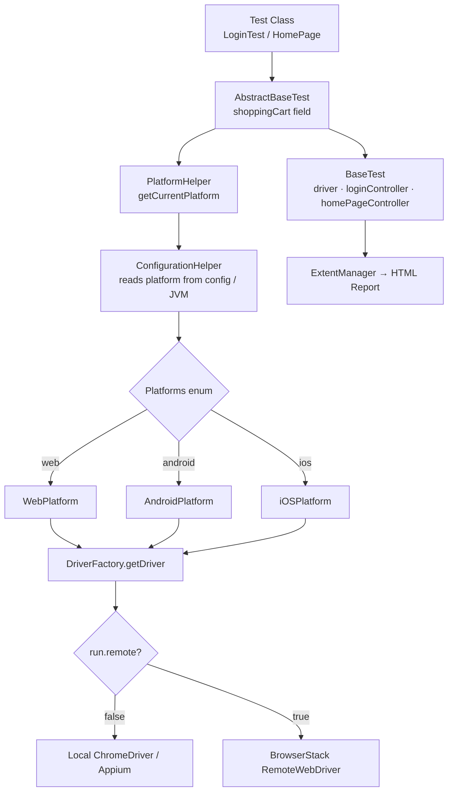
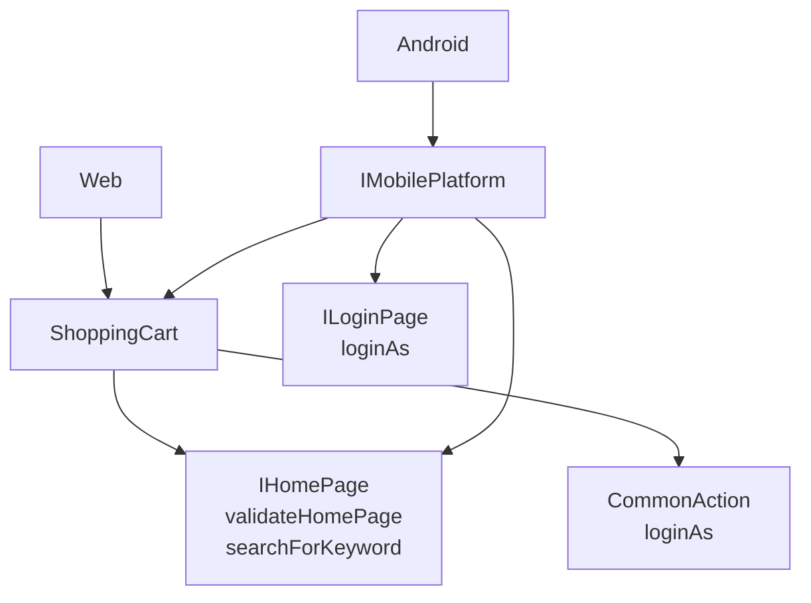
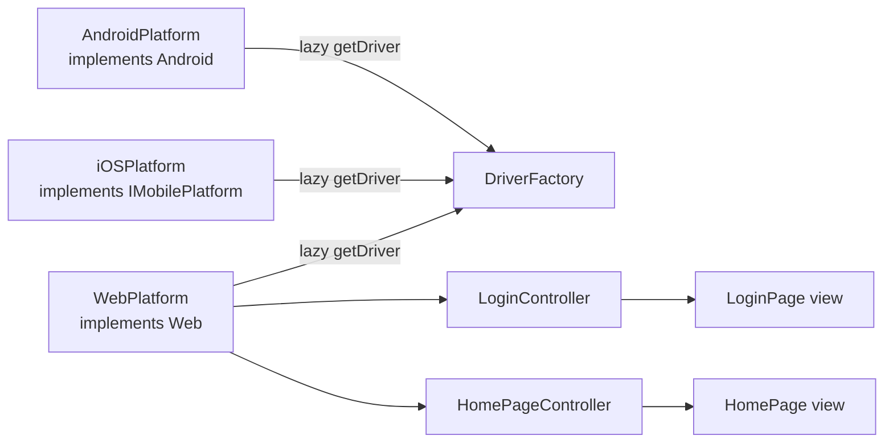
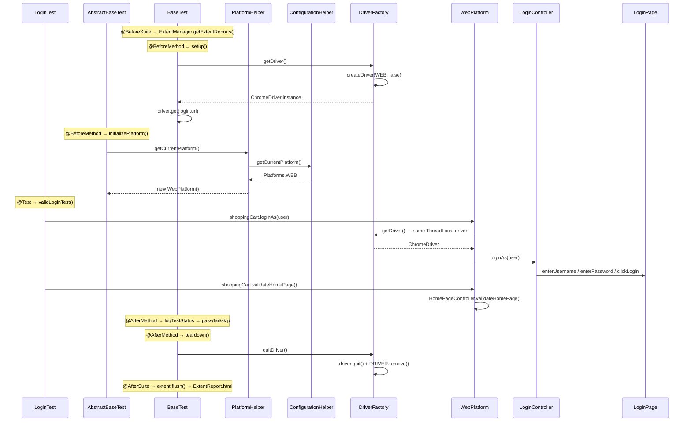
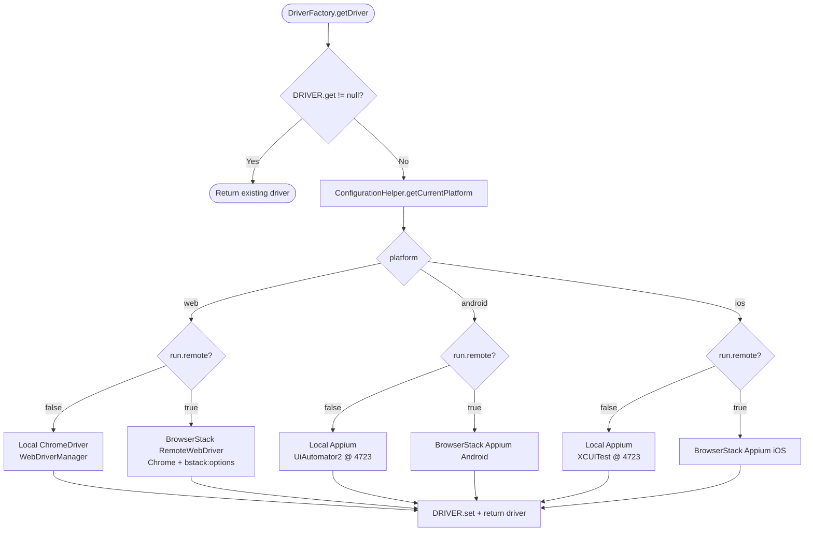
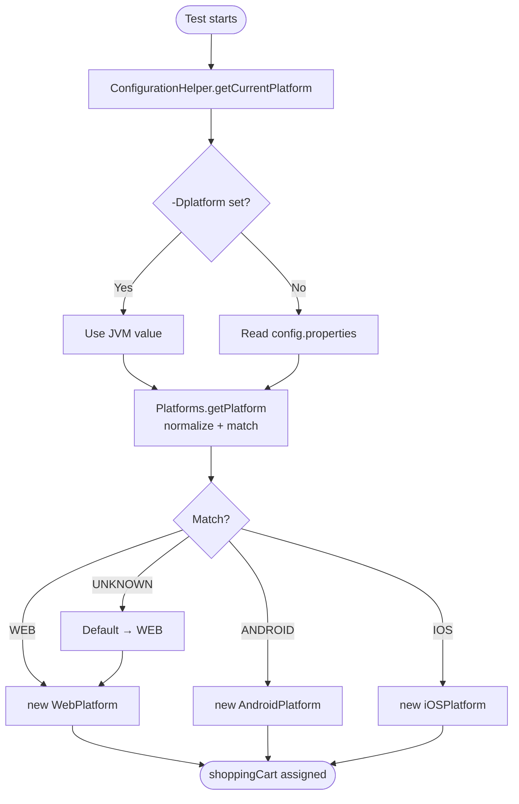

# SeleniumTestNGFramework

A multi-platform, MVC-structured test automation framework built with **Java**, **Selenium 4**, **TestNG**, and **ExtentReports**. Supports **Web**, **Android**, and **iOS** execution — both **locally** and on **BrowserStack** — controlled entirely through `config.properties` or JVM arguments.

---

## Table of Contents

- [Tech Stack](#tech-stack)
- [Project Structure](#project-structure)
- [Architecture Overview](#architecture-overview)
- [Layer Breakdown](#layer-breakdown)
- [Execution Flow](#execution-flow)
- [Driver Factory Flow](#driver-factory-flow)
- [TestNG Lifecycle Flow](#testng-lifecycle-flow)
- [Platform Selection Flow](#platform-selection-flow)
- [Configuration Reference](#configuration-reference)
- [Run Commands](#run-commands)
- [BrowserStack Integration](#browserstack-integration)
- [Reporting](#reporting)
- [Adding a New Test](#adding-a-new-test)

---

## Tech Stack

| Tool | Version | Purpose |
|---|---|---|
| Java | 17+ | Core language |
| Selenium | 4.20.0 | Browser automation |
| TestNG | 7.9.0 | Test runner and lifecycle management |
| WebDriverManager | 6.2.0 | Automatic driver binary management |
| ExtentReports | 5.0.9 | HTML test reporting |
| Maven | 3.8+ | Build and dependency management |

---

## Project Structure

```
SeleniumTestNGFramework/
├── pom.xml                            # Maven build config + dependencies
├── testng.xml                         # TestNG suite definition
├── src/
│   ├── main/java/
│   │   ├── controller/                # Platform controllers (MVC - Controller)
│   │   │   ├── WebPlatform.java       # Web implementation of ShoppingCart
│   │   │   ├── AndroidPlatform.java   # Android implementation
│   │   │   ├── iOSPlatform.java       # iOS implementation
│   │   │   ├── LoginController.java   # Login page action controller
│   │   │   └── HomePageController.java# Home page action controller
│   │   ├── model/                     # Data models (MVC - Model)
│   │   │   └── User.java              # User credentials model
│   │   ├── view/                      # Page objects (MVC - View)
│   │   │   ├── LoginPage.java         # Login page elements + interactions
│   │   │   └── HomePage.java          # Home page elements + interactions
│   │   ├── interfaces/                # Action + platform contracts
│   │   │   ├── CommonAction.java      # loginAs contract
│   │   │   ├── ILoginPage.java        # Login page contract
│   │   │   ├── IHomePage.java         # Home page contract
│   │   │   ├── ShoppingCart.java      # Top-level test interface
│   │   │   ├── Web.java               # Web platform contract
│   │   │   ├── Android.java           # Android platform contract
│   │   │   └── IMobilePlatform.java   # Shared mobile platform contract
│   │   ├── helper/                    # Platform resolution helpers
│   │   │   ├── Platforms.java         # Enum: WEB, ANDROID, IOS, UNKNOWN
│   │   │   ├── ConfigurationHelper.java # Reads platform from config/JVM
│   │   │   └── PlatformHelper.java    # Creates fresh platform per test
│   │   └── utils/                     # Framework utilities
│   │       ├── DriverFactory.java     # ThreadLocal WebDriver creation
│   │       ├── BaseTest.java          # TestNG lifecycle hooks
│   │       ├── AbstractBaseTest.java  # Injects shoppingCart into tests
│   │       ├── ConfigReader.java      # Reads config.properties
│   │       └── ExtentManager.java     # Singleton ExtentReports manager
│   └── test/
│       ├── java/tests/                # Test classes
│       │   ├── LoginTest.java
│       │   └── HomePage.java
│       └── resources/
│           └── config.properties      # All runtime configuration
└── target/
    └── ExtentReport.html              # Generated HTML test report
```

---

## Architecture Overview

The framework follows **MVC (Model-View-Controller)** combined with an **interface-driven platform abstraction**. Tests interact only with `ShoppingCart`, backed by the right platform at runtime.



---

## Layer Breakdown

### Interfaces Layer

Contracts each platform must fulfil. Tests never reference concrete classes — only interfaces.



| Interface | Extends | Methods |
|---|---|---|
| `CommonAction` | — | `loginAs(User)` |
| `ILoginPage` | — | `loginAs(User)` |
| `IHomePage` | — | `validateHomePage()`, `searchForKeyword(String)` |
| `ShoppingCart` | `CommonAction`, `IHomePage` | inherits all |
| `Web` | `ShoppingCart` | inherits all |
| `IMobilePlatform` | `ILoginPage`, `IHomePage`, `ShoppingCart` | inherits all |
| `Android` | `IMobilePlatform` | inherits all |

---

### Model Layer

Plain data objects — no Selenium dependency.

```java
User user = new User("username@mail.com", "P@ssword@1");
user.getUsername(); // → "username@mail.com"
user.getPassword(); // → "P@ssword@1"
```

---

### Controller Layer

Each controller lazily resolves `WebDriver` from `DriverFactory` so it always uses the active test session.



**WebPlatform** — fully implemented, delegates to controllers:

| Method | Delegates to |
|---|---|
| `loginAs()` | `LoginController.loginAs()` → `LoginPage` |
| `validateHomePage()` | `HomePageController.validateHomePage()` → `HomePage` |
| `searchForKeyword()` | `HomePageController.searchForKeyword()` → `HomePage` |

**AndroidPlatform / iOSPlatform** — lazy driver getter wired, method stubs ready for implementation.

---

### View Layer

Page Object Model classes. Encapsulate locators and low-level interactions. Controllers call views — tests never touch views directly.

| View | Elements |
|---|---|
| `LoginPage` | `#userEmail`, `#userPassword`, `#login` |
| `HomePage` | HOME button, search input, price tag |

---

### Utils Layer

| Class | Responsibility |
|---|---|
| `DriverFactory` | Creates one `WebDriver` per thread via `ThreadLocal`. Routes to local or BrowserStack based on config. |
| `ConfigReader` | Loads `config.properties` from classpath; falls back to file-system path. |
| `BaseTest` | Holds `@BeforeSuite`, `@BeforeMethod`, `@AfterMethod`, `@AfterSuite` lifecycle hooks. |
| `AbstractBaseTest` | Injects `shoppingCart` instance before each test via `@BeforeMethod`. |
| `ExtentManager` | Singleton `ExtentReports` that writes `target/ExtentReport.html`. |

#### Why `ThreadLocal<WebDriver>`?

```java
private static final ThreadLocal<WebDriver> DRIVER = new ThreadLocal<>();
```

Parallel test threads each get an **isolated** `WebDriver`:

```
Thread 1 (LoginTest)    → DRIVER.get() → ChromeDriver #1
Thread 2 (HomePageTest) → DRIVER.get() → ChromeDriver #2
Thread 3 (CartTest)     → DRIVER.get() → ChromeDriver #3
```

`DRIVER.remove()` in `quitDriver()` clears the thread slot — prevents stale driver leaks when TestNG reuses threads.

---

### Helper Layer

| Class | Responsibility |
|---|---|
| `Platforms` | Enum `WEB / ANDROID / IOS / UNKNOWN` with null-safe, case-insensitive resolution |
| `ConfigurationHelper` | Reads `platform` key; JVM `-Dplatform=` takes priority |
| `PlatformHelper` | Creates a **fresh** `ShoppingCart` per test — avoids stale driver state |

---

## Execution Flow



---

## Driver Factory Flow



---

## TestNG Lifecycle Flow

```mermaid
flowchart TD
    S([Suite starts]) --> BS[@BeforeSuite<br/>setupReport]
    BS --> BM1[@BeforeMethod<br/>BaseTest.setup<br/>DriverFactory.getDriver<br/>driver.get loginUrl]
    BM1 --> BM2[@BeforeMethod<br/>BaseTest.createTest<br/>extent.createTest]
    BM2 --> BM3[@BeforeMethod<br/>AbstractBaseTest.initializePlatform<br/>PlatformHelper.getCurrentPlatform]
    BM3 --> TEST[@Test method<br/>shoppingCart.loginAs<br/>shoppingCart.validateHomePage]
    TEST --> AM1[@AfterMethod<br/>logTestStatus]
    AM1 --> AM2[@AfterMethod<br/>teardown<br/>DriverFactory.quitDriver<br/>DRIVER.remove]
    AM2 --> MORE{More tests?}
    MORE -->|Yes| BM1
    MORE -->|No| AS[@AfterSuite<br/>extent.flush → ExtentReport.html]
    AS --> E([Suite ends])
```

---

## Platform Selection Flow



---

## Configuration Reference

All settings in `src/test/resources/config.properties`. Every key is overridable via `-D` JVM argument.

```properties
# ── Application ───────────────────────────────────────────────────────────────
login.url=https://rahulshettyacademy.com/client/#/auth/login
login.username=your_email@mail.com
login.password=YourPassword
home.searchbox=apple watch

# ── Execution mode ────────────────────────────────────────────────────────────
platform=web                  # web | android | ios
run.remote=false              # false = local | true = BrowserStack

# ── BrowserStack Web ──────────────────────────────────────────────────────────
browserstack.browser=Chrome
browserstack.browserVersion=latest
browserstack.os=Windows
browserstack.osVersion=11
browserstack.projectName=SeleniumTestNGFramework
browserstack.buildName=Local Build
browserstack.sessionName=Login Smoke
browserstack.local=false
browserstack.localIdentifier=

# ── Android ───────────────────────────────────────────────────────────────────
android.deviceName=emulator-5554
android.platformVersion=13.0
android.browserName=Chrome

# ── iOS ───────────────────────────────────────────────────────────────────────
ios.deviceName=iPhone 15
ios.platformVersion=17.0
ios.browserName=Safari
```

### Credential Resolution Priority

```
1. JVM property       -Dbrowserstack.username=...
2. Primary env var    BROWSERSTACK_USERNAME
3. Alias env var      BROWSERSTACK_USER
4. config.properties  browserstack.username=...
```

---

## Run Commands

### Local Web (default)

```bash
mvn test
```

### Override platform at runtime

```bash
mvn test -Dplatform=web
mvn test -Dplatform=android   # requires local Appium on port 4723
mvn test -Dplatform=ios       # requires local Appium on port 4723
```

### Run a specific test

```bash
mvn test -Dtest=tests.LoginTest
```

### Run via TestNG suite

```bash
mvn test -DsuiteXmlFile=testng.xml
```

---

## BrowserStack Integration

### Step 1 — Export credentials

```bash
export BROWSERSTACK_USERNAME="your_browserstack_username"
export BROWSERSTACK_ACCESS_KEY="your_browserstack_access_key"
```

### Step 2 — Run on BrowserStack

```bash
# Web
mvn test -Drun.remote=true -Dplatform=web

# Android
mvn test -Drun.remote=true -Dplatform=android

# iOS
mvn test -Drun.remote=true -Dplatform=ios
```

### Optional capability overrides

```bash
mvn test \
  -Drun.remote=true -Dplatform=web \
  -Dbrowserstack.browser=Chrome \
  -Dbrowserstack.browserVersion=latest \
  -Dbrowserstack.os=Windows \
  -Dbrowserstack.osVersion=11 \
  -Dbrowserstack.buildName="CI Build" \
  -Dbrowserstack.sessionName="LoginTest"
```

### BrowserStack Local tunnel

Start the [BrowserStack Local binary](https://www.browserstack.com/local-testing) first, then:

```bash
mvn test \
  -Drun.remote=true -Dplatform=web \
  -Dbrowserstack.local=true \
  -Dbrowserstack.localIdentifier="local_tunnel_1"
```

---

## Reporting

ExtentReports generates an HTML report automatically after each run:

```
target/ExtentReport.html
```

Open in any browser. Logs pass / fail / skip per test method with timestamps.

---

## Adding a New Test

### Step 1 — Create your test class

```java
package tests;

import model.User;
import org.testng.annotations.Test;
import utils.AbstractBaseTest;
import utils.ConfigReader;

public class CartTest extends AbstractBaseTest {

    @Test
    public void addToCartTest() {
        User validUser = new User(
            ConfigReader.get("login.username"),
            ConfigReader.get("login.password")
        );
        shoppingCart.loginAs(validUser);
        shoppingCart.validateHomePage();
        shoppingCart.searchForKeyword(ConfigReader.get("home.searchbox"));
    }
}
```

### Step 2 — Add to `testng.xml`

```xml
<class name="tests.CartTest"/>
```

### Step 3 — Add new actions (if needed)

1. Add method signature to `CommonAction` or `IHomePage`
2. Implement in `WebPlatform` (delegate to the appropriate controller)
3. Add stubs in `AndroidPlatform` and `iOSPlatform`

> ⚠️ Tests should **never** call `driver` directly or instantiate controllers/page objects.  
> Always go through `shoppingCart`.
